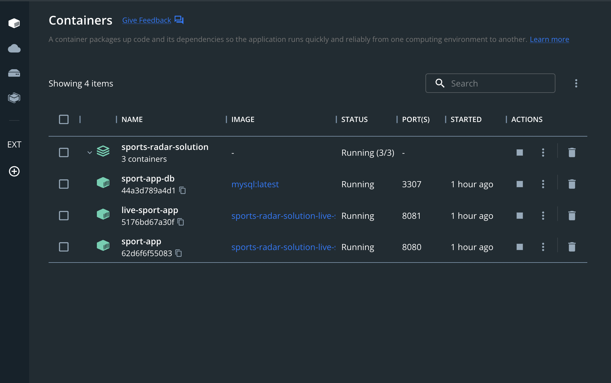

# SportsRadar NHL Solution

## Author: Clayton Mercer

### Dependencies:

- Node 16
- Docker & Docker Desktop
- Postman

### Setup

- run `yarn`
- run `yarn build:docker`
- run `yarn up`
- run `yarn create-database`
- Import the `Sport App API.postman_collection.json` into Postman for routes to run later to test the app's functionality

### Functionality

1. This project's infrastructure contains 3 separate docker containers
   - sport_app (REST API)
   - sport_app_db (MySQL database)
   - live_sport_app (A continuous cron-based script that fetches live and past NHL data)
2. Firstly, the app needs to import and save a schedule's game list for future reference. A good example is the 2022 - 2023 schedule
   - `GET: http://localhost:8080/v1/schedule?season_start=2022&season_end=2023`
3. If you open `live-sport-app`'s console, you can see the application pulling NHL data every minute for any game scheduled to start within the last 6 hours. From these requests to NHL, all data (teams, players, status, score, etc...) can be backfilled and ingested for the game that needs updated. This data is stored as JSON in the game table.

   

4. To see all game data for `n` days in the past, send a `GET` request to `http://localhost:8080/v1/games?days_ago=6` (Also contained in the Postman collection)

5. You can find a game that has been backfilled by the live app and using an id obtained by `step 4`'s REST API call you can set a `GET` request to `http://localhost:8080/v1/games/2022020059` (just an example id)

```
{
    "id": 2022020059,
    "eventTime": "2022-10-21T04:57:00.000Z",
    "awayTeam": "ANA",
    "homeTeam": "BOS",
    "fullContent": "{...}"
}
```

### Extra Info

- The public live feed I used to pull scheduling data was from `https://live.nhl.com/GameData/SeasonSchedule-20222012.json`
- More data that was backfilled from NHL was documented [here](https://github.com/erunion/sport-api-specifications/tree/master/nhl)
